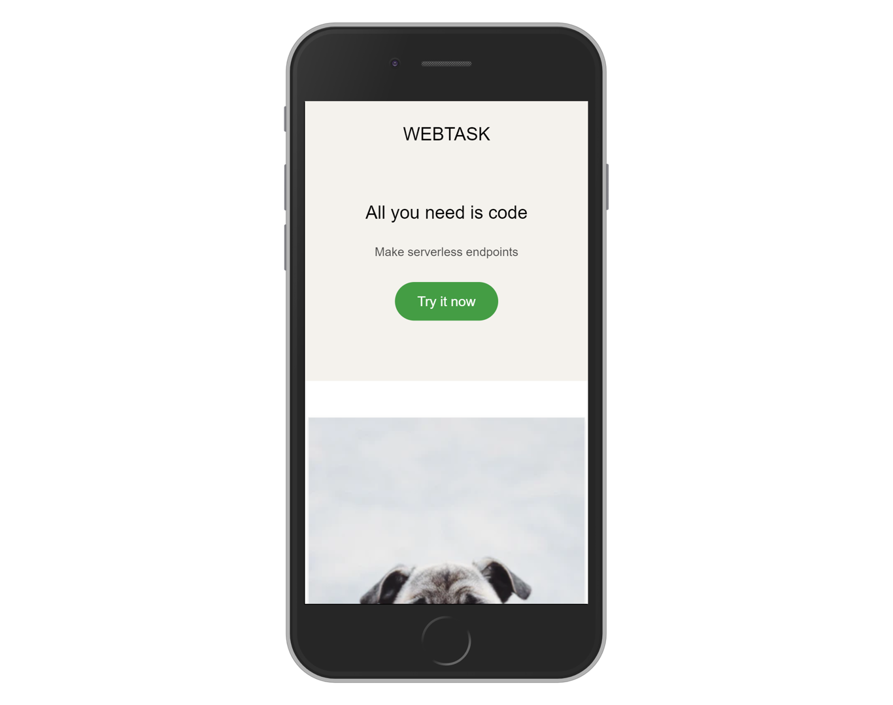

# CSS Framework Demo

> A simple SCSS Grid based framework.

[//]: # (Screenshot, Application concept art etc)


[//]: # (Live Demo link)
<p align="center">
  <a href="https://juzqrios.github.io/css-framework-demo/">Live Demo</a>
</p>

## Built With

* HTML
* SCSS

## Get Started

### Setup

1. Clone this repository.

```bash
git clone git@github.com:juzQrios/css-framework-demo.git
```

2. Parse SCSS to CSS.

```bash
sass ./assets/css/scss/main.scss ./assets/css/main.css
```

3. Open `./assets/framework/main.scss` to inspect the framework SCSS file.

### Tests

While it is a good practice to test code, this project doesn't have any tests right now but I might add them in future.

### Deployment

Deploy root directory after parsing SCSS to CSS.

## Contributing

Contributions, issues and feature requests are welcome!

Feel free to checkout this project's [Kanban board](https://github.com/juzQrios/css-framework-demo/projects/1) or [issues page](https://github.com/juzQrios/css-framework-demo/issues).

## Acknowledgments

* [960 Grid System](https://960.gs/)

## License

This project is [MIT](./LICENSE) licensed.

## Authors

#### Darshan

* GitHub: [@juzQrios](https://github.com/juzQrios)
* Linkedin: [Darshan J](https://www.linkedin.com/in/jayadevdarshan/)
* Email: <jayadev.darshan@gmail.com>

#### Raphael Noriode

* GitHub: [@oghenebrume50](https://github.com/oghenebrume50)
* Email: <raphlbrume@gmail.com>
